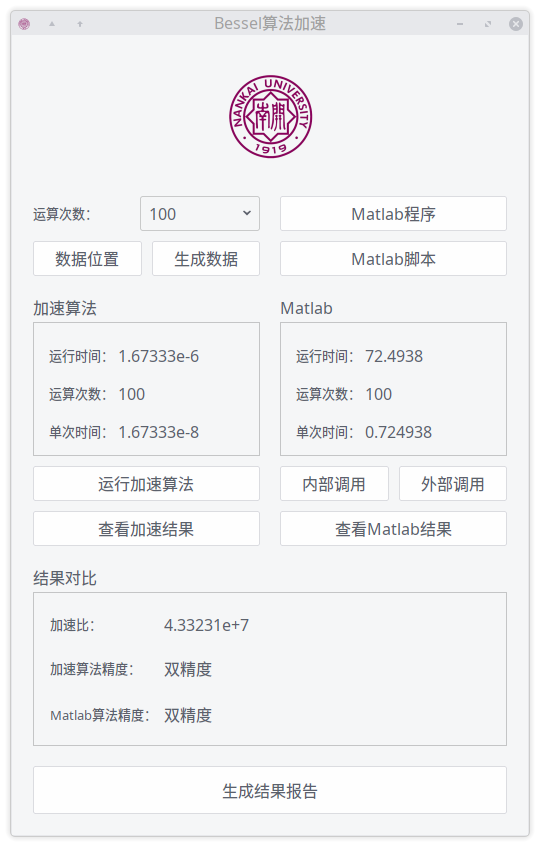

# Bessel0-Accel-Algorithm
Zero-order Bessel Accel Algorithm(With QT)

## 简要介绍

结合Bessel函数的单调这一特点，利用二分法查找方程根，同时对零阶Bessel函数作了核心优化。

在同一测试机器上，速度能达到Matlab(R2017b)的10^7数量级。

## 核心算法

核心思想是利用多项式逼近零阶Bessel函数，同时考虑到实际使用(如信号采样)的需求，舍弃部分精度，以换取计算速度。

## 优化处理

 - 充分利用零阶Bessel函数的特点，由于其为偶函数，故可减半计算区间。又考虑到在[0,+∞)内零阶Bessel函数单调，故可考虑快速二分求解，将时间降为log级别。同时这也能便于精度控制，只需二分区间长度小于给定epsilon即可
 - 合理整合参数，简化重复运算
 - 使用试探法确定一个较小的有效区间。这对于二分求解有着较大的提升效果
 
## 待优化

 - 考虑并行化，利用CPU多核心加速
 
## Demo

利用QT设计了简单的界面，具备一定的实用化功能

